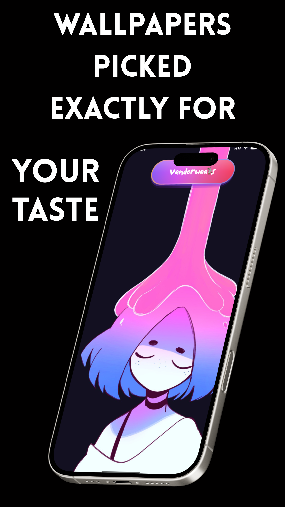
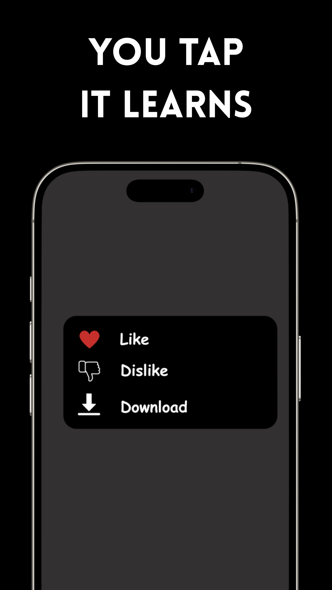

<div align="center">
    
    <h1>Vanderwaals</h1>
    <p>
        
        
        
    </p>
    <p><strong>AI-Powered Wallpaper App That Learns Your Aesthetic</strong></p>
    <p><i>Intelligent wallpaper personalization using machine learning</i></p>
</div>

---

## ✨ What is Vanderwaals?

**Vanderwaals** is an intelligent Android wallpaper application that uses on-device machine learning to understand your aesthetic preferences and automatically deliver fresh wallpapers you'll love. No more manually browsing through thousands of images—let the AI learn what you like and find similar wallpapers for you.

### 🎯 Key Highlights

- **🤖 ML-Powered Personalization**: MobileNetV3 neural network extracts aesthetic features from images
- **📚 Curated Collections**: 6,000+ wallpapers from GitHub + 10,000+ from Bing's photography archive
- **🔒 Privacy-First**: 100% offline ML processing, zero analytics, no data collection
- **⚡ Smart Learning**: Adaptive algorithm that improves with every like/dislike
- **🎨 Material 3 Design**: Beautiful, modern UI with dynamic color theming

---

## Screenshots

<div align="center">
    <br/>
      
      
      
      
    <br/>
    
    
    
    <br/>
</div>

## 📥 Download
<div align="center">
  <a href="https://github.com/avinaxhroy/Vanderwaals/releases">
    
  </a>
</div>

### Requirements
- **Android 12.0 (API 31)** or higher
- **~50MB** storage space (app + cache)
- **Internet connection** for initial wallpaper sync (then works offline)


## 🚀 Features

### 🎨 Intelligent Personalization

#### Auto Mode
Start fresh with algorithm-selected wallpapers from curated collections. The app learns your taste as you provide feedback.

#### Personalize Mode
Upload one favorite wallpaper and instantly get 100+ similar matches. The algorithm analyzes:
- **Deep Visual Features (70%)**: MobileNetV3 embeddings capture artistic style, composition, and mood
- **Color Palette (20%)**: LAB color space analysis for perceptually accurate matching
- **Category Affinity (10%)**: Learns your preference for categories (gruvbox, nord, nature, minimal, etc.)

### 🧠 Adaptive Learning Algorithm

- **Exponential Moving Average (EMA)**: Smoothly integrates new preferences without forgetting old ones
- **Implicit Feedback**: Learns from wallpaper duration (quick changes = dislike, long duration = like)
- **Temporal Diversity**: Prevents repetitive categories with recency penalties
- **Progressive Trust**: Balances original embeddings with learned preferences over time

### 📚 Rich Content Sources

- **GitHub Collections** (6,000+ wallpapers):
  - [dharmx/walls](https://github.com/dharmx/walls) - Curated aesthetic wallpapers
  - [D3Ext/aesthetic-wallpapers](https://github.com/D3Ext/aesthetic-wallpapers) - Minimalist designs
  - [makccr/wallpapers](https://github.com/makccr/wallpapers) - Linux ricing wallpapers
  - [Gingeh/wallpapers](https://github.com/Gingeh/wallpapers) - Anime aesthetics
  - [FrenzyExists/wallpapers](https://github.com/FrenzyExists/wallpapers) - Dark themes

- **Bing Photography** (10,000+ archive):
  - Daily featured wallpapers in UHD quality
  - Professional photography from around the world

- **Weekly Auto-Sync**: Automatic content updates from all sources

### ⚙️ Powerful Automation

- **Auto-Change Modes**:
  - Every device unlock
  - Hourly intervals
  - Daily at custom time
  - Manual only

- **Apply To**:
  - Lock screen
  - Home screen
  - Both screens simultaneously

- **Smart Crop**: Intelligent image cropping using saliency detection to focus on interesting regions

### 📊 History & Analytics

- **Chronological Timeline**: View all applied wallpapers with timestamps
- **Quick Actions**: Like ❤️, Dislike 👎, or Download wallpapers directly
- **Smart Grouping**: Date-based sections (Today / Yesterday / Month Year)
- **Full-Screen Preview**: Zoomable image viewer for detailed inspection

### 🎨 Modern UI/UX

- **Material 3 Design**: Modern, beautiful interface following Material Design 3 guidelines
- **Dynamic Colors**: Automatic color extraction from wallpapers (Android 12+)
- **Dark Theme**: AMOLED-optimized pure black theme option
- **Smooth Animations**: Polished transitions and interactions with Lottie animations
- **Adaptive Layout**: Optimized for phones and tablets


## 🏗️ Architecture

Vanderwaals follows **Clean Architecture** principles with **MVVM** pattern for separation of concerns and testability.

```
📁 me.avinas.vanderwaals/
├── 📁 algorithm/              # Machine Learning Components
│   ├── EmbeddingExtractor         # MobileNetV3 TFLite wrapper
│   ├── SimilarityCalculator       # Cosine similarity + color matching
│   ├── PreferenceUpdater          # EMA learning algorithm
│   ├── EnhancedImageAnalyzer      # Color, composition, mood analysis
│   ├── ExplorationStrategies      # Epsilon-greedy exploration
│   └── SmartCrop                  # Intelligent image cropping
│
├── 📁 data/                   # Data Layer
│   ├── 📁 entity/                 # Room Database Entities
│   │   ├── WallpaperMetadata          # ID, URL, embedding, colors, category
│   │   ├── WallpaperHistory           # Applied wallpapers with feedback
│   │   ├── UserPreferences            # Learned preference vector
│   │   └── DownloadQueue              # Queued downloads
│   ├── 📁 dao/                    # Database Access Objects
│   │   ├── WallpaperMetadataDao
│   │   ├── WallpaperHistoryDao
│   │   ├── UserPreferencesDao
│   │   └── DownloadQueueDao
│   ├── 📁 repository/             # Repository Pattern
│   │   ├── WallpaperRepository
│   │   ├── PreferenceRepository
│   │   ├── ManifestRepository
│   │   └── BingRepository
│   └── 📁 datastore/              # Preferences Storage
│       └── SettingsDataStore
│
├── 📁 domain/                 # Business Logic Layer
│   └── 📁 usecase/                # Use Cases (Single Responsibility)
│       ├── ExtractEmbeddingUseCase        # TFLite inference
│       ├── FindSimilarWallpapersUseCase   # Similarity search
│       ├── SelectNextWallpaperUseCase     # Epsilon-greedy selection
│       ├── ProcessFeedbackUseCase         # Explicit feedback learning
│       ├── ProcessImplicitFeedbackUseCase # Duration-based learning
│       ├── UpdatePreferencesUseCase       # EMA preference updates
│       ├── GetRankedWallpapersUseCase     # Similarity ranking
│       ├── SyncWallpaperCatalogUseCase    # Manifest sync
│       ├── QueueNextWallpapersUseCase     # Download queue management
│       └── InitializePreferencesUseCase   # Cold start handling
│
├── 📁 network/                # Network Layer
│   ├── GitHubApiService           # GitHub raw file API
│   └── BingApiService             # Bing wallpaper API
│
├── 📁 worker/                 # Background Processing
│   ├── WallpaperChangeWorker      # Auto wallpaper changes
│   ├── CatalogSyncWorker          # Weekly manifest sync
│   ├── BatchDownloadWorker        # Background downloads
│   ├── ImplicitFeedbackWorker     # Duration tracking
│   ├── CleanupWorker              # Cache management
│   └── WorkScheduler              # WorkManager coordination
│
├── 📁 receiver/               # Broadcast Receivers
│   ├── DeviceUnlockReceiver       # Unlock-triggered changes
│   └── BootCompletedReceiver      # Restart work schedules
│
└── 📁 ui/                     # Presentation Layer (Jetpack Compose)
    ├── 📁 main/                   # Main screen with wallpaper preview
    ├── 📁 history/                # Feedback history & analytics
    ├── 📁 settings/               # App configuration
    ├── 📁 onboarding/             # First-time setup wizard
    └── 📁 components/             # Reusable UI components
```

## 🛠️ Technologies

### Core Stack

<div>


</div>

### Key Libraries

#### Machine Learning
- **[TensorFlow Lite](https://www.tensorflow.org/lite)** - On-device ML inference with GPU acceleration
- **[MobileNetV3-Small](https://tfhub.dev/)** - Lightweight image embedding model (576 dimensions)

#### Android Jetpack
- **[Jetpack Compose](https://developer.android.com/compose)** - Modern declarative UI toolkit
- **[Material 3](https://m3.material.io/)** - Latest Material Design components
- **[Room](https://developer.android.com/training/data-storage/room)** - Type-safe SQLite database
- **[WorkManager](https://developer.android.com/topic/libraries/architecture/workmanager)** - Background task scheduling
- **[DataStore](https://developer.android.com/topic/libraries/architecture/datastore)** - Preferences storage
- **[Navigation Compose](https://developer.android.com/jetpack/compose/navigation)** - Screen navigation
- **[Lifecycle](https://developer.android.com/topic/libraries/architecture/lifecycle)** - Lifecycle-aware components

#### Dependency Injection & Networking
- **[Dagger Hilt](https://dagger.dev/hilt/)** - Dependency injection framework
- **[Retrofit](https://square.github.io/retrofit/)** - Type-safe REST API client
- **[OkHttp](https://square.github.io/okhttp/)** - HTTP client with interceptors
- **[Gson](https://github.com/google/gson)** - JSON serialization/deserialization

#### Image Loading & UI
- **[Landscapist Glide](https://github.com/skydoves/landscapist)** - Compose-native image loading with LRU cache
- **[Lottie Compose](https://github.com/airbnb/lottie)** - High-quality animations
- **[Accompanist](https://google.github.io/accompanist/)** - Jetpack Compose utilities
- **[Zoomable](https://github.com/usuiat/Zoomable)** - Pinch-to-zoom image viewer
- **[Android Palette](https://developer.android.com/develop/ui/views/graphics/palette-colors)** - Color extraction from images

#### Other
- **[Kotlin Serialization](https://github.com/Kotlin/kotlinx.serialization)** - Type-safe serialization
- **[Kotlin Coroutines](https://kotlinlang.org/docs/coroutines-overview.html)** - Asynchronous programming
- **[DocumentFileCompat](https://github.com/ItzNotABug/DocumentFileCompat)** - SAF utilities

---

## 🧪 How It Works

### 1️⃣ Image Embedding Extraction

```kotlin
// MobileNetV3-Small extracts 576-dimensional feature vector
val embedding = embeddingExtractor.extract(bitmap)
// Example: [0.23, -0.45, 0.12, ..., 0.67] (576 floats)
```

The neural network captures:
- **Artistic style** (minimalist, detailed, abstract)
- **Composition** (rule of thirds, symmetry, balance)
- **Subject matter** (landscape, portrait, architecture)
- **Mood & atmosphere** (warm, cool, energetic, calm)

### 2️⃣ Similarity Calculation

```kotlin
// Combined scoring with multiple factors
finalScore = (
    embeddingSimilarity * 0.70 +  // Deep visual features
    colorSimilarity * 0.20 +       // LAB color matching
    categoryBonus * 0.10           // Category preference
) + temporalDiversityBoost         // Prevent repetition
```

**Cosine Similarity** for embeddings:
```
similarity = (A · B) / (||A|| × ||B||)
```

**LAB Color Distance** (perceptually uniform):
```
distance = √[(L₁-L₂)² + (a₁-a₂)² + (b₁-b₂)²]
```

### 3️⃣ Preference Learning (EMA)

```kotlin
// Exponential Moving Average for smooth learning
newPreference = α × newFeedback + (1 - α) × oldPreference
```

**Learning rate** adapts based on feedback count:
- New users: α = 0.30 (learn faster)
- Experienced users: α = 0.15 (stable preferences)

**Implicit feedback** from duration:
- < 5 minutes = Dislike (30% strength)
- > 24 hours = Like (30% strength)

### 4️⃣ Adaptive Exploration

**Epsilon-greedy** strategy balances exploitation vs exploration:
```
exploration_rate = 0.20 → 0.05 (decays over time)
```

With 20% probability, show:
- New categories (< 3 times viewed)
- Under-explored content
- High-variance wallpapers

### 5️⃣ Smart Cropping

```kotlin
// Saliency detection using edge + color contrast
val focalPoint = smartCrop.detectSalientRegion(bitmap)
val croppedBitmap = smartCrop.cropToAspectRatio(bitmap, focalPoint, targetRatio)
```

Ensures preview matches applied wallpaper—no surprises!

---

## 🔒 Privacy & Security

Vanderwaals is designed with **privacy as a core principle**:

✅ **100% Offline ML Processing**
- All TensorFlow Lite inference runs on-device
- No cloud API calls for ML operations
- Your preferences never leave your phone

✅ **Zero Analytics & Tracking**
- No Firebase, Google Analytics, or any tracking SDKs
- No crash reporting services
- No advertising SDKs

✅ **No Personal Data Collection**
- App doesn't request contacts, location, or camera
- Only required permissions: Internet (wallpaper downloads), Storage (applied wallpapers)

✅ **Open Source & Auditable**
- Full source code available under GPL-3.0
- No obfuscated code or hidden functionality
- Community-verifiable privacy claims

### Network Requests

The **only** external network calls:
1. **GitHub API** - Fetch wallpaper manifest (weekly sync)
2. **Bing API** - Download daily wallpaper (optional)
3. **Direct Image URLs** - Download wallpapers from curated sources

All network calls are **transparent and documented** in the source code.

## 🚧 Building from Source

### Prerequisites

- **Java 17** or later
- **Android Studio Ladybug (2024.2.1)** or later
- **Android SDK 31+** (minimum SDK 31, target SDK 36)
- **Gradle 8.10.2** (via wrapper)

### Setup Steps

1. **Clone the repository**:
   ```bash
   git clone https://github.com/avinaxhroy/Vanderwaals.git
   cd Vanderwaals/Vanderwaals
   ```

2. **Open in Android Studio**:
   - `File → Open` → Select the `Vanderwaals/Vanderwaals` directory
   - Wait for Gradle sync to complete

3. **Download TensorFlow Lite Model** (if not included):
   ```bash
   mkdir -p app/src/main/assets/models
   # Download MobileNetV3-Small from TensorFlow Hub
   # Place as: app/src/main/assets/models/mobilenet_v3_small.tflite
   ```

4. **Build the app**:
   - **Debug**: Click `▶ Run` or `./gradlew assembleDebug`
   - **Release**: `Build → Generate Signed Bundle/APK` or `./gradlew assembleRelease`

5. **Run on device/emulator**:
   ```bash
   ./gradlew installDebug
   ```

### Build Variants

- **Debug**: Development build with debug logging and local manifest support
- **Release**: Optimized with ProGuard/R8, code shrinking, and resource optimization

### Configuration

Edit `app/build.gradle.kts` to customize:
- `applicationId` - Package name
- `versionCode` & `versionName` - Version info
- `MANIFEST_BASE_URL` - GitHub raw URL for wallpaper manifest

---

## 🙏 Acknowledgments

### Credits

**Original Work**: Massive thanks to **[Anthony La (@Anthonyy232)](https://github.com/Anthonyy232)** for creating [Paperize](https://github.com/Anthonyy232/Paperize), which provides the solid foundation inspiration for Vanderwaals.

**Wallpaper Sources**:
- [dharmx/walls](https://github.com/dharmx/walls)
- [D3Ext/aesthetic-wallpapers](https://github.com/D3Ext/aesthetic-wallpapers)
- [makccr/wallpapers](https://github.com/makccr/wallpapers)
- [Gingeh/wallpapers](https://github.com/Gingeh/wallpapers)
- [FrenzyExists/wallpapers](https://github.com/FrenzyExists/wallpapers)
- [Bing Wallpaper API](https://www.bing.com/)

**ML Models**:
- [MobileNetV3](https://tfhub.dev/) - Pre-trained image classification from TensorFlow Hub


## 🤝 Contributing

We welcome contributions from the community! Together, we can make Vanderwaals even better.

**Before contributing**, please:
1. Read our [CONTRIBUTING.md](CONTRIBUTING.md) for guidelines
2. Review and accept the [Contributor License Agreement (CLA)](CLA.md)
3. Understand our [dual licensing model](#-license)

Your contributions will be licensed under AGPL-3.0 and available for commercial licensing as well. This ensures the project remains sustainable while maintaining transparency.

### Areas for Improvement

#### 🤖 Algorithm Enhancements
- Implement CLIP embeddings for text+image understanding
- Add vision transformers (ViT) for better feature extraction
- Multi-modal learning (user descriptions + images)
- Dynamic learning rate scheduling

#### 📚 Data Sources
- Reddit wallpaper scraping (r/wallpapers, r/wallpaper)
- Wallhaven API support
- User-submitted collections

#### ⚡ Performance Optimization
- TFLite GPU delegate for faster inference
- Database query optimization with indexes
- Parallel similarity calculations
- Incremental manifest updates

#### 🎨 UI/UX Improvements
- Tablet and landscape layouts
- Home screen widgets
- Live wallpaper support
- Wallpaper editor (crop, filters, adjustments)
- Accessibility improvements (TalkBack, screen readers)

#### 🧪 Testing
- Unit tests for algorithm components
- UI tests with Compose Test
- Integration tests for use cases
- Performance benchmarks


---

## 📜 License

### Dual Licensing Model

Vanderwaals uses a **dual licensing approach** to balance openness with sustainability:

#### 🔓 Open Source: AGPL-3.0

For the community, Vanderwaals is licensed under **AGPL-3.0** (GNU Affero General Public License v3.0):

- ✅ **Free to use** for personal, educational, and open-source projects
- ✅ **Study and modify** the source code
- ✅ **Contribute improvements** back to the project
- ✅ **Full transparency** - see exactly how the app works

**Requirements**:
- If you modify and distribute Vanderwaals, you **must share your source code** under AGPL-3.0
- If you run a modified version as a network service, users must have access to the source code
- Any derivative work must also be licensed under AGPL-3.0

```
Vanderwaals - AI-Powered Wallpaper App
Copyright (C) 2024-2025 Avinash/Confused Coconut

This program is free software: you can redistribute it and/or modify
it under the terms of the GNU Affero General Public License as published by
the Free Software Foundation, either version 3 of the License, or
(at your option) any later version.

This program is distributed in the hope that it will be useful,
but WITHOUT ANY WARRANTY; without even the implied warranty of
MERCHANTABILITY or FITNESS FOR A PARTICULAR PURPOSE. See the
GNU Affero General Public License for more details.

You should have received a copy of the GNU Affero General Public License
along with this program. If not, see <https://www.gnu.org/licenses/>.
```

📄 **Read the full license**: [LICENSE](LICENSE)

#### 💼 Commercial: Proprietary License

For commercial use, rebranding, or proprietary distribution, a **commercial license** is required.

**You need a commercial license if you want to**:
- Distribute a modified or rebranded version without sharing source code
- Use Vanderwaals in a proprietary application
- Offer Vanderwaals as a commercial service (SaaS, hosted, etc.)
- Monetize through ads, subscriptions, or paid features

**Benefits**:
- No source code disclosure required
- Technical support and updates
- Custom licensing terms
- Legal protection and indemnification

📄 **Learn more**: [COMMERCIAL_LICENSE.md](COMMERCIAL_LICENSE.md)

### 🏷️ Trademark Protection

The **"Vanderwaals" name and logo are trademarks** and are **not** covered by the AGPL-3.0 license.

- ✅ You **can** use the code under AGPL-3.0
- ✗ You **cannot** use the "Vanderwaals" name or logo in modified versions

If you create a fork or derivative, you **must rebrand** it with a different name and logo.

📄 **Trademark policy**: [TRADEMARK.md](TRADEMARK.md)

### 🤝 Contributor License Agreement

Contributors retain ownership but grant the project rights to use contributions under both licenses.

📄 **CLA details**: [CLA.md](CLA.md)

### Why This Approach?

This multi-layered protection strategy ensures:

- **🌟 Transparency**: Anyone can audit the code for security and privacy
- **🤝 Community Growth**: Open contributions improve the app for everyone
- **🛡️ Protection**: Prevents unauthorized rebranding and exploitation
- **💰 Sustainability**: Commercial licensing supports long-term development
- **✅ Trust**: Clear legal framework benefits users and contributors

---

### 📋 Summary

| Use Case | License Required | Source Code Disclosure |
|----------|------------------|------------------------|
| Personal use | AGPL-3.0 (free) | Not required |
| Open-source project | AGPL-3.0 (free) | Yes (if distributed) |
| Modified distribution | AGPL-3.0 (free) | **Yes (required)** |
| Commercial/proprietary | Commercial (paid) | No |
| Rebranding | Commercial (paid) + Trademark permission | No |

📧 **Questions?** Contact: hi@avinas.me

---

### Derivative Work Notice

Vanderwaals is a derivative work based on [Paperize](https://github.com/Anthonyy232/Paperize) by Anthony La (Apache-2.0 license). The original wallpaper infrastructure, UI architecture, and WorkManager integration have been preserved and extended with ML-powered personalization features.

**Key additions**:
- TensorFlow Lite integration for image embeddings
- EMA learning algorithm for preference adaptation
- Similarity ranking system (cosine + color + category)
- Enhanced image analysis (composition, mood, color)
- Smart cropping with saliency detection
- New onboarding screens for personalization modes
- GitHub and Bing wallpaper source integrations

---

## 📞 Support

### Having Issues?

- 🐛 **Bug Reports**: [GitHub Issues](https://github.com/avinaxhroy/Vanderwaals/issues)
- 💡 **Feature Requests**: [GitHub Discussions](https://github.com/avinaxhroy/Vanderwaals/discussions)
- 📧 **Email**: [Contact Developer](mailto:hi@avinas.me)

### Documentation

- 📖 **Setup Guide**: [SETUP.md](SETUP.md)
- 📖 **API Documentation**: [API.md](API.md)
- 📖 **Contributing**: [CONTRIBUTING.md](CONTRIBUTING.md)

---

## ⭐ Show Your Support

If you find Vanderwaals helpful:

- ⭐ **Star this repository** on GitHub
- 🐛 **Report bugs** and suggest features
- 🤝 **Contribute** code or documentation
- 💬 **Share** with friends who love wallpapers

---

<div align="center">
    <p><strong>Made with ❤️ by Avinas/ Confused Coconut</strong></p>
    <p>
        <a href="https://github.com/avinaxhroy">GitHub</a> •
        <a href="https://github.com/avinaxhroy/Vanderwaals/releases">Releases</a> •
        <a href="https://github.com/avinaxhroy/Vanderwaals/issues">Issues</a>
    </p>
    <p><i>Powered by TensorFlow Lite & Jetpack Compose</i></p>
</div>
